---
output:
  bookdown::pdf_document2: 
    number_sections: true
    toc: no
    toc_depth: 3
title: Uporaba Excel Power Query-a za združevanje podatkov iz Si-Stat
---

Author |  Version        | Status   | Date
:------:|:--------------:|:--------:|:-----------:
  mz    |0.1.0          | draft    |   2023-04-13
  mz    |1.0.0          | issued    |   `r Sys.Date()`
  
*Da ne pozabiš vsega naučenega na tečaju napredne uporabe Excela, imaš tukaj osvežitveno domačo nalogo, ki vključuje tudi precej navodil in poglavje Troubleshooting.*

\renewcommand{\contentsname}{Kazalo}
\tableofcontents


# Nagradna igra 

Naloga ima več verzij: izberi si tisto, ki ti ustreza, ali pa začni z osnovno in jo potem nadgradi. Vsa navodila, potrebna za osnovno in napredno verzijo, so opisana v nadaljevanju. Za najnaprednejšejšo pa bo potrebno malce eksperimentiranja. 

Prvi trije, ki končate nalogo, dobite nagrado :)


## Osnovna verzija

1. Izberi si dve časovni seriji iz dveh različnih tabel na Si-Stat-u z enakim časovnim intervalom (recimo obe četrtletni). (Zaradi točke 4. premisli, kateri spremenljivki izbereš.)

2. Odpri nov Excel fajl in s pomočjo spodnjih navodil vzpostavi podatkovni povezavi z obema viroma podatkov. (Skoraj 100% boš imel podatke z decimalkami, zato nujno preberi razdelek \@ref(dec) o manjkajočih decimalnih vejicah!)

3. Ko imaš vzpostavljeni obe povezavi (ni treba naložiti podatkov, dovolj je vzpostaviti "connection only" povezavo), združi obe tabeli glede na časovno dimenzijo. (Glej razdelek \@ref(sec1) *Združevanje tabel*.) To bo seveda delovalo samo, če imata obe seriji enake časovne intervale. Če ne, si v napredni verziji naloge in kar pogumno nadaljuj tam!

4. Nato dodaj nov stolpec, ki je izračunan iz obeh časovnih serij. (Glej razdelek \@ref(sec3)  *Dodajanje novega stolpca*.)

5. Ko si zadovoljen s tem, kako si pripravil poizvedbo, naloži podatke na nov zavihek in jih prikaži z enostavnim linijskim grafom. 

6. Zdaj se vrni v Power Query Editor in poizvedbi dodaj filter, npr. izberi samo podatke po letu 2010. Preveri, kaj se je zgodilo z grafom. 

## Napredna verzija 

1. Izberi si dve časovni seriji iz dveh različnih tabel na Si-Stat-u z *različnim* časovnim intervalom (recimo ena mesečna in ena letna).  (Zaradi točke 5. premisli, kateri spremenljivki izbereš.)

2. Odpri nov Excel fajl in s pomočjo spodnjih navodil vzpostavi podatkovni povezavi z obema viroma podatkov. (Skoraj 100% boš imel podatke z decimalkami, zato nujno preberi razdelek \@ref(dec) o manjkajočih decimalnih vejicah!)

3. Tisto serijo, ki ima bolj podrobne podatke, agregiraj na raven druge serije (npr. mesečne podatke agregiraj na letne). Seveda pazi, da izbereš ustrezno funkcijo glede na tip podatka. (Glej razdelek \@ref(sec2) *Agregiranje*.)

4. Ko imaš vzpostavljeni obe povezavi (ni treba naložiti podatkov, dovolj je vzpostaviti "connection only" povezavo), združi obe tabeli glede na časovno dimenzijo. (Glej razdelek \@ref(sec1) *Združevanje tabel*.)

5. Nato dodaj nov stolpec, ki je izračunan iz obeh časovnih serij. (Glej razdelek \@ref(sec3)  *Dodajanje novega stolpca*.)

6. Ko si zadovoljen s tem, kako si pripravil poizvedbo, naloži podatke na nov zavihek in jih prikaži z enostavnim linijskim grafom. 

7. Zdaj se vrni v Power Query Editor in poizvedbi dodaj filter, npr. izberi samo podatke po letu 2010. Preveri, kaj se je zgodilo z grafom. 

## Še najnaprednejšejša verzija

1. Izberi si dve časovni seriji iz dveh poljubnih (različnih) virov. Npr Si-Stat, Eurostat, obstoječ Excel ali csv ali pdf fajl na tvojem disku - najbolje nekaj, kar sicer pogosto uporabljaš. Odvisno od vira, ki si si ga izbral, ti bodo spodnja navodila bolj ali manj v pomoč. V vsakem primeru jih preberi, potem pa uporabi google, sodelavce ali Majo Z., da najdeš rešitev, kako vzpostaviti želene povezave. 

2. Nadaljuj s točko 2. naprednih navodil.


# Priprava poizvedbe na Si-Stat

1. Na strani [Si-Stat](https://pxweb.stat.si/SiStat/sl) poiščeš tabelo iz katere želiš dobiti podatke. 

2. Izbereš želene kategorije za vsako dimenzijo in klikneš "Izpis podatkov".

3. Preveri, da imaš tabelo pravilno zavrteno in orientirano: to pomeni, (i) da imaš podatke za vsako obdobje v svoji vrstici, torej čas poteka od zgoraj navzdol in (ii) da imaš enovrstični header, torej je v stolpcih samo ena dimenzija, ostale pa vse v vrsticah. Da to dosežeš, uporabi gumbke za vrtenje tabele, dokler ne dobiš želenega rezultata. 

```{r, echo=FALSE, out.width="50%"}
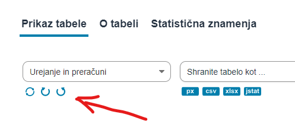
```                

4. Potem klikni na tekst "`Shrani poizvedbo`" nad tabelo. Ker hočemo dinamično poizvedbo, ki se podaljšuje, preveri, da imaš izbrano prvo možnost "*Stalni začetni in drseči zaključni časovni presek (podaljševanje serije)*".

5. Za izpis serije pa izberi "*CSV (ločeno s podpičjem), brez glave (.csv)*". In klikni na "`Shrani poizvedbo`"

```{r, echo=FALSE, out.width="70%"}
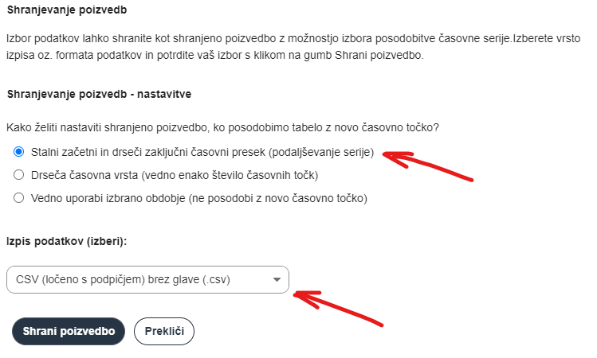
```       

6. Prikazalo se ti bo polje z url-jem tvoje poizvedbe. To si skopiraj, ker ga boš rabil pri pripravi povezave v Power Query-u. 

```{r, echo=FALSE, out.width="60%"}
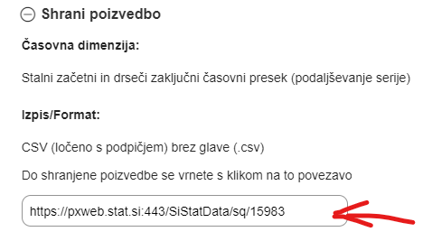
```    

# Priprava povezave v Excel Power Query-u. 

1. Odpri nov, svež Excel fajl. 

2. Na zavihku `Data` izberi `From Web` 

```{r, echo=FALSE, out.width="60%"}
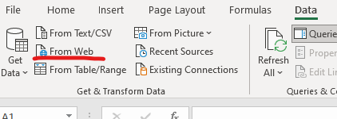
```

3. V polje `URL` skopiraj url, ki si ga dobil v zadnji točki priprave poizvedbe, in klikni `OK`.

```{r, echo=FALSE, out.width="60%"}
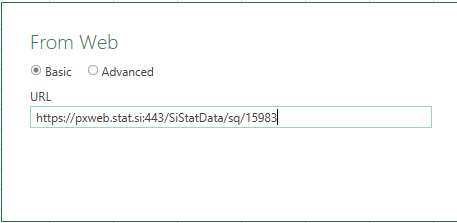
```

4. če je šlo vse po sreči, bi moral videti nekaj podobnega, kot je na spodnji sliki. Najbolj pomembno je, da se v tem predogledu vidi več stolpcev. Glej troubleshooting poglavje \@ref(misterij), če ne gre povsem gladko. 

```{r, echo=FALSE, out.width="100%"}
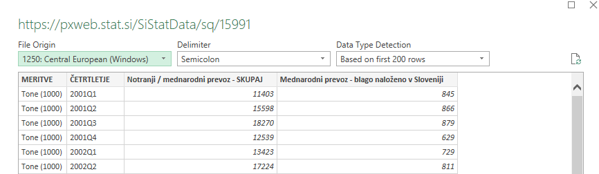
```

5. Zdaj sta na voljo dve možnosti, odvisno od tega, kaj nameravaš delati s podatki: podatke lahko naložiš (*Load*) ali pa se pred tem lotiš nadaljnjih transformacij (*Transform*). Nobena odločitev pa ni dokončna - če podatke naložiš, jih še vedno lahko kasneje spreminjaš in seveda obratno. 

# Nalaganje podatkov

Pri nalaganju podatkov so relevantne naslednje možnosti:
```{r, echo=FALSE, out.width="100%"}
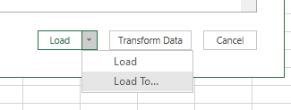
```

1. *Load*: default nalaganje naloži tabelo v nov zavihek. 

2. *Load to*: ti da več možnosti, kjer lahko recimo določiš specifično lokacijo tabele. 

3. *Load to*: in izbira *Only create connection* je tudi zelo uporabna možnost, kadar ne rabimo tabele neposredno, ampak jo bomo uporabili kasneje, kot input za novo poizvedbo. 

```{r, echo=FALSE, out.width="100%"}
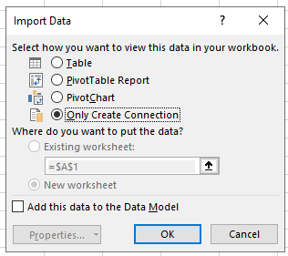
```

Ne glede na to, katero možnost si izbral, imaš zdaj v Excelu aktivno povezavo na izbrani vir podatkov. Ta vir lahko urejaš tako, da zavihku *Data* izbereš *Queries & Connections*, kar ti bo odprlo seznam odprtih povezav oziroma poizvedb na desni strani ekrana.  

## Osveževanje podatkov

Povezava na podatke oz. poizvedba, ki si jo pripravil, se ne osvežuje avtomatično, kadar pride do spremembe pri viru. 

Podatke lahko osvežiš na več načinov:

1. Z ikonico desno od vsake posamezne povezave. 
```{r, echo=FALSE, out.width="100%"}
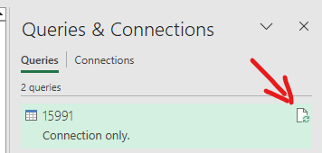
```

2. Z ikonico *Refresh all* na vrhu zavihka *Data*, ki osveži vse poizvedbe. 

3. Lahko pa si nastaviš lastnosti vsake povezave, kjer določiš, kdaj se poizvedba samodejno posodobi. Do tega okenca prideš tako, da z desno klikneš na poizvedbo v seznamu na desni strani ekrana in izbereš možnost *Properties* na dnu. 

```{r, echo=FALSE, out.width="100%"}
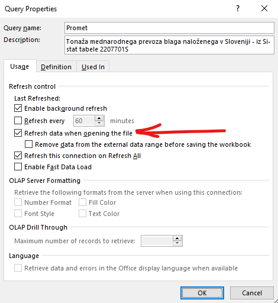
```


4. Najbolj uporabna kljukica tukaj je *Refresh data when opening the file*, ki naredi to, kar piše ;)

5. Velja biti pozoren na opcijo *Enable background refresh*: to se zdi uporabno, ker pomeni, da med osveževanjem lahko uporabljaš Excel in delaš kaj drugega. Ampak pomeni pa tudi, da Excel ne čaka z drugimi stvarmi, medtem ko se v ozadju posodabljajo podatki, in v praksi to lahko pomeni, da recimo vrtilna tabela iz teh podatkov ne bo počakala, da se podatki najprej posodobijo - v tem primeru jo bo treba še enkrat osvežit. Samo omenim, če se komu to zgodi, da ve, zakaj. 

6. Poleg tega ni slaba ideja, da povezavo poimenuješ bolj opisno, kar tudi narediš v tem pogovornem okencu na vrhu v polju *Query name* in po želji še *Description*. 


# Transformacije podatkov

Z izbiro opcije *Transform*, preden podatke naložiš, se odpre t.i. "*Power Query Editor*". Ravno tako se odpre, če dvakrat klikneš na poizvedbo na desni strani ekrana. 

Power query editor je tako zelo powerful, da se tukaj niti približno ne moremo dotakniti velike večine funkcionalnosti - vedi le, da če si lahko zamisliš neko transformacijo, se jo verjetno da narediti. Zato vprašaj ali pogooglaj :)

*Pozor! Če iz Si-Stata uvažaš podatke z decimalnimi številkami in/ali podatke z manjkajočimi vrednostmi, potem si nujno poglej zadnja dva razdelka troubleshooting-a, kjer so razloženi koraki, kako podatke pravilno transformirati v tem primerih. *

## Pogoste transformacije

Tukaj bom naštela samo nekaj primerov transformacij, ki lahko pridejo prav:

### Column split

Zavihek home, *Split column*. 

- izberi stolpec in klikni na *Split column* in izberi metodo po kateri hočeš, da se stolpec razdeli. 
- klasičen primer je recimo `2020Q04` razbiti na stolpca `2020` in `Q04`, tako da ga razdeliš na četrti poziciji.

### Replace values

Zavihek Home, *Replace values*.

Se lahko uporablja kadar želiš zamenjati celotno vsebino celice:

- izberi stolpec, ki ga želiš popraviti in klikni na *Replace values* in vnesi vrednsti v polji *Value to find* in  *Replace with*, npr. "Podatki z izločenim vplivom sezone" in  "Desezonirani podatki". 

Lahko pa to transformacijo uporabiš tudi, kadar želiš spremeniti ali odstraniti samo del besedila, npr. če želiš "Skupaj dejavnosti" spremeniti v "Skupaj", potem lahko v okence *Value to find* vneseš "dejavnosti" in *Replace with* pustiš prazno. 

Ta transformacija bi lahko bila tudi uporabna, če se želiš znebiti tistih pik, ki jih SURS uporablja za prikaz hierarhičnosti kategorij. Vendar je potrebno to narediti za vsa možna števila pik, zato je morda lažja rešitev v naslednjem razdelku.


### Dodajanje novega stolpca {#sec3}

Zavihek *Add column*, gumb *Custom Column*. 

- klikni na gumb *Custom Column* in izberi ime novega stolpca ter v spodnje okence vnesi formulo tako, da s pomočjo gumba *Insert* prestavljaš želene stolpce iz desnega okenca. 

V okencu *Custom column formula* poleg enostavnih operacij med stolpci lahko uporabiš **ogromno število** *Power query funkcij*, ki jih ne bom tukaj obravnavala. Ampak samo za primer, kako bi se znebili tistih pik omenjenih zgoraj. 

- klikni na gumb *Custom Column* in izberi ime novega stolpca in v okence vnesi funkcijo `Text.Remove`, tako kot je prikazano na sliki spodaj. Funkcija bo iz polj zbrisala to, kar vnesemo v oklepaj na drugem mestu, v tem primeru torej piko. 

```{r, echo=FALSE, out.width="100%"}
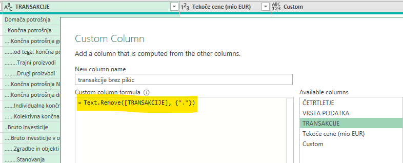
```

Na dnu okenca je tudi link [*Learn about power query formulas*](https://learn.microsoft.com/en-gb/powerquery-m/power-query-m-function-reference), kjer lahko spoznate bogastvo funkcionalnosti, ki so na voljo. 

### Preimenovanje stolpca

Zavihek Transform, *Rename*

- Izberi stolpec in klikni Rename in preimenuj stolpec po želji.

### Agregiranje {#sec2}

Zavihek Home ali Trasnform, *Group By*

- Izberi stolpec, po katerem želiš grupirati, in klikni *Group By*
- v pogovornem okencu, ki se odpre, določi, katere agregacije želiš
- če jih želiš več, klikni na *Advanced*
- npr. če imaš mesečne podatke, jih lahko združiš po letu in glede na tip podatka izbereš vsote ali povprečja za vsak stolpec, ki te zanima. 

NB: agregiranje iz mesecev v leta ne bi smelo predstavljati težave. Oznako za mesece npr. 2022M04 je treba ločiti v letnico (column split) in potem ta stolpec uporabiti za združevanje. Agregiranje iz mesecev v četrtletja pa bo zahtevalo še dodaten korak: pripraviti moraš *šifrant*, torej tabelico, ki prikazuje, kako se meseci rekodirajo v četrtletja (en stolpec gre od 1 do 12, drugi pa 111222333444. To tabelo moraš spremeniti v pravo Excel tabelo (*Insert table*) in potem narediti povezavo do nje: *Data/Get Data/From Table/Range*. Zdaj pa moraš to tabelo združiti s svojo glavno podatkovno tabelo po mesecu (glej razdelek \@ref(sec1). Tako dobiš pravilno označena četrtletja in zdaj lahko agregiraš podatke po njih.  

### Filtriranje vrstic 

S klikom na trikotniček desno od imena stolpca lahko stolpec filtriraš ali razvrstiš po želji. 

### Združevanje tabel {#sec1}

Zavihek Home, *Merge queries*

Za združevanje tabel rabiš imeti vsaj dve tabeli oz. dve povezavi odprti. Poleg tega morata imeti obe tabeli vsaj en stolpec, po katerem se lahko združita. 

Združevanja se lotiš tako, da odpreš Power Query Editor v eni od obeh tabel. 

Možnih je več tipov združevanj - levo, desno, notranje ipd. najbolje, da malo eksperimentiraš. 

Ko potrdiš merge, se bo v tabeli pojavil not stolpec z ikonico z dvema puščicama. Na to ikonico klikneš in izbereš katere stolpce iz druge tabele želiš prikazane (če ne želiš vseh) - šele potem se ti prikaže združena tabela.  

```{r, echo=FALSE, out.width="100%"}
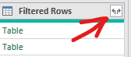
```


## Vrstni red transformacij


Po vsaki transformaciji boš opazil, da se v okencu na desni strani dodajajo novi koraki tvoje poizvedbe. 

Tukaj lahko:

- zbrišeš korak s klikom na križec na levi strani pred zapisom
- spreminjaš vrstni red korakov z metodo "drag and drop"
- ponovno urejaš posamezen korak, če ga želiš popraviti, tako, da dvakrat klikneš na njega. 

```{r, echo=FALSE, out.width="100%"}
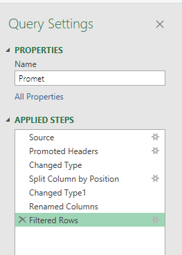
```

Prvi trije koraki: *Source*, *Promoted Headers* in *Changed Type* se avtomatično pripravijo ob pripravi povezave. Te tri korake res predlagam, da pustiš pri miru, razen če veš, kaj delaš (*cf.* Troubleshooting). Ostale korake praviloma dodajaš po vrsti, dokler nisi zadovoljen s predogledom, ki ga vidiš v editorju. 

Vrstni red korakov je pomemben! Recimo če najprej razdeliš stolpec s četrtletji na leto in četrtletje in potem grupiraš podatke glede na leto, ne moreš tega narediti v obratnem vrstnem redu. Zato se ne ustrašiti, če se ti pojavi spodnje opozorilo: Excel samo preverja, da res želiš nov korak vriniti med že obstoječe - ker ponavadi hočeš dodati korak na koncu. 

```{r, echo=FALSE, out.width="100%"}
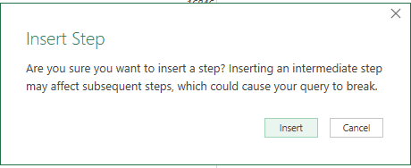
```


Ko si zadovoljen s predogledom poizvedbe, pa izbereš `Close & Load` in, če še nisi, izbereš lokacijo, kamor želiš, da se ti tabela z rezultati poizvedbe naloži.


# Troubleshooting

## Troubleshooting manjkajočih stolpcev {#misterij}

Včasih se - iz meni misterijoznih razlogov - zgodi, da pri uvozu podatkov Excel noče pravilno razumeti stolpcev oz. delimiterjev. Težko reproduciram to situacijo, ampak po mojih izkušnjah se *manj pogosto* zgodi, če:

* startaš z novim, svežim Excel fajlom,
* Si-stat poizvedbo izvoziš brez glave (glava tukaj ne pomeni headerja, torej vrstice z imeni stolpcev, ampak tekst nad tem, ki ni del prave tabele),
* vse v prvo narediš prav :)

Včasih se navkljub vsemu zgodi naslednja situacija: čeprav imaš kot delimiter izbrano podpičje (*semicolon*), v predogledu vidiš samo prvi stolpec.


```{r, echo=FALSE, out.width="100%"}
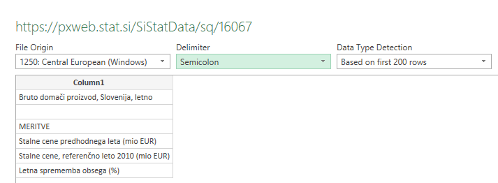
```


V tem primeru - če nočeš začeti spet od začetka - lahko zadevo rešiš takole: klikni na gumb *Transform*, da se odpre Power Query Editor. Tu zdaj vidiš samo prvi stolpec, zato *enkrat* klikni na prvi korak poizvedbe v desnem okencu: *Source*

```{r, echo=FALSE, out.width="100%"}
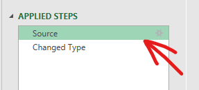
```

Zdaj pa poglej v funkcijsko vrstico, kjer se ti je izpisala koda za ta korak poizvedbe, ki izgleda približno takole:

```{r, echo=FALSE, out.width="100%"}
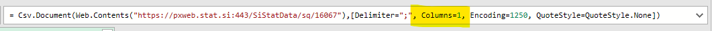
```

Težava je torej, da ima power query navodilo, da uvozi samo en stolpec. Zdaj pa ročno popravi število stolpcev za tekstom `Columns=` in pritisni enter. Če ne veš točno, koliko stolpcev je probaj in ko se posodobi predogled, boš videl ali imaš vse podatke ali je treba število stolpcev povečati. 


## Troubleshooting manjkajočih decimalk {#dec}

Če boš na Si-Statu izbral sprejemljivko, ki ima decimalke, se bo zgodilo naslednje: Si-Stat pri izvozu uporablja angleški sistem oznak, torej decimalno piko in ne vejice, toda tvoj Excel je nastavljen na slovenske regionalne nastavitve in zato decimalne pike ne razume. 

Če imaš v podatkih decimalke, potem ti ne bo všeč, kaj se je zgodilo v koraku *Change type*, ker je namreč ta korak verjetno narobe določil tip spremenjlivke. Namesto decimalne številke je določil tip *števke* (integer -- `Int64.Type`) in tako je `80.0` namesto `80,0`, postala `800`. 

```{r, echo=FALSE, out.width="100%"} 
 
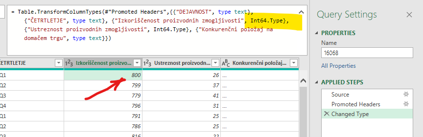

```

Najenostavnejši način, ki sem ga našla do zdaj, je, da na zavihku *Data* izbereš gumb *Get data* in na koncu seznama *Query options*. V okencu, ki se odpre, izbereš pod *Regional settings* eno -- katerokoli -- od angleških možnosti. 

```{r, echo=FALSE, out.width="100%"}
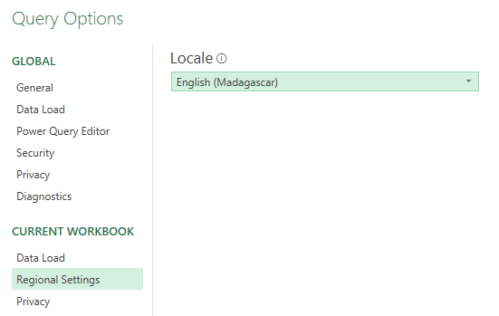
```

Potem moraš najverjetneje ponoviti uvoz, da 'zagrabi'. 

S to rešitvijo je seveda potencialna težava, če imaš v enem fajlu povezave na vire, ki uporabljajo različne sisteme: enega z decimalnimi vejicami in enega z decimalnimi pikami. Potem se je treba zadeve lotiti drugače, tako da popraviš poizvedbo samo v koraku *Change type*, ampak računam, da je to tako redko, da ne bom še tega malce bolj zakompliciranega postopka tukaj razlagala, seveda pa me lahko vedno pridete vprašati. 


## Troubleshooting neobičajnih manjkajočih vrednosti

Če boš na Si-Statu izbral spremenljivko, ki ima manjkajoče vrednosti, bodo te verjetno označene s tremi pikami (`...`) ali čem podobnim, česar Excel ne bo razpoznal kot manjkajočo vrednost. 

V tem primeru bo tudi stolpec uvozil kot tekst namesto kot številko, kar ti lahko povzroča težave kasneje, zato je to najbolje urediti že v Power Query-u. 

Najprej se na desnem seznamu korakov postavi na obstoječ korak *Change Type*. Nato se postavi na dotični stolpec in iz zgornjega menija ali iz menija po desnem kliku izberi možnost *Data Type* ali *Change data type* in izberi ustrezen tip - verjetno *Decimal number* ali pa *Whole number*. 

Power query te bo opozoril, da stolpec že ima spremembo tipa, in na to mu odgovoriš, da želiš zamenjati to spremembo: *Replace current*.

```{r, echo=FALSE, out.width="100%"}
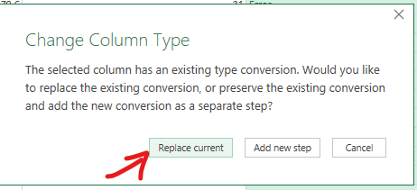
```

Po tej spremembi boš opazil naslednje: namesto `...` je zdaj v teh poljih *Error*, ker seveda tri pike niso pravilnega tipa. Zato je potreben naslednji korak: errorje je treba zamenjati na `null` - to je pravilna oznaka za manjkajočp vrednost. 

Klikni na mali trikotniček zraven gumba *Replace values* in izberi drugo možnost: *Replace errors*. V okencu, ki se ti odpre, v polje vpiši *null* in klikni OK. 

```{r, echo=FALSE, out.width="100%"}
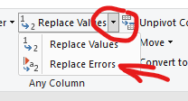
```


